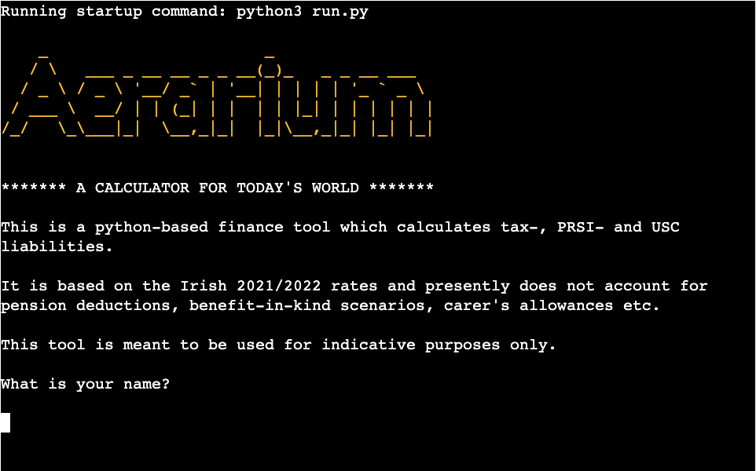
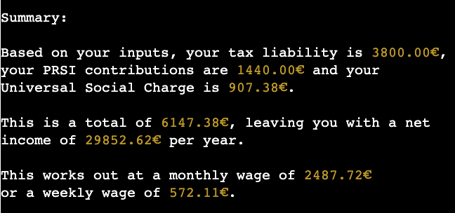
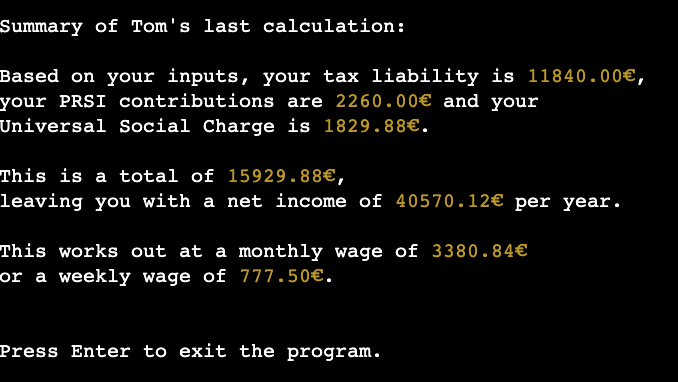
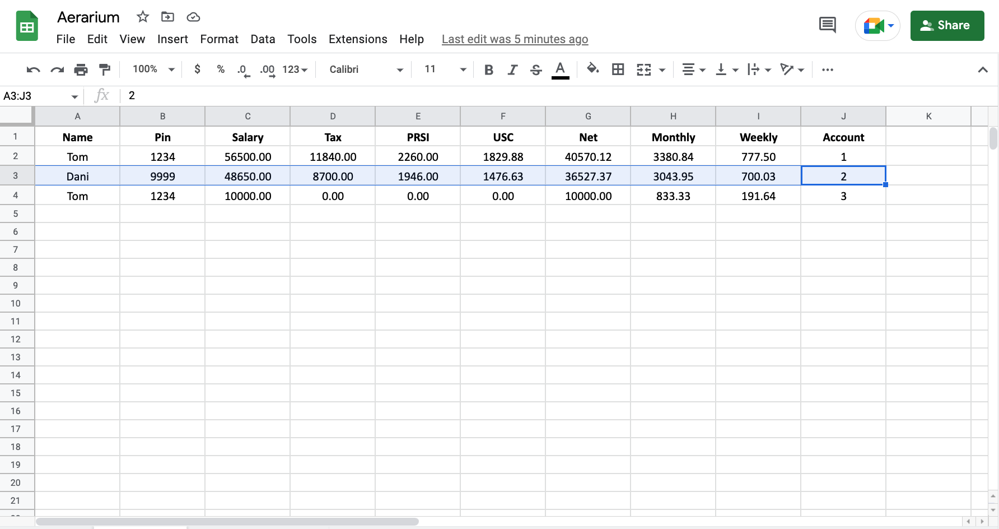
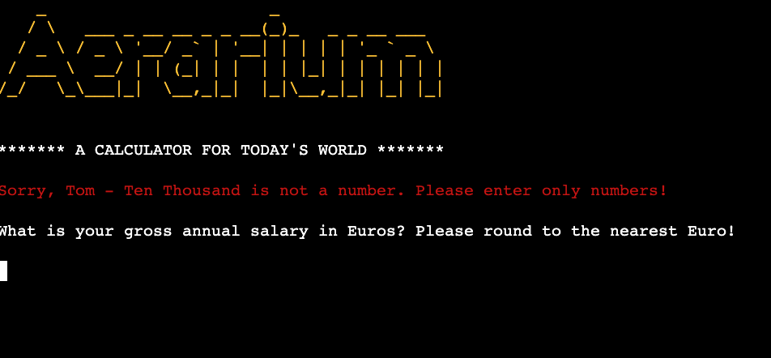

# **Aerarium - A basic Python-based Tax Calculator**
## **Description**
Aerarium is a small program that allows a user to provide a few details relating to their salary and tax status and then calculates and outputs a summary of expected deducations. These are based on accurate Irish 21/22 rates and return values consistent with other such calculators available on the web. 

The program allows a user to save their calculations for retrieval at a later date, using a log-in process. 

The application was named after the term which describes the ancient Roman treasury department, in line with the theme of finances and taxation.

It runs in the terminal window and is deployed to Heroku. 

The live application can be found here: [Aerarium - A basic Python-based Tax Calculator](https://aerarium.herokuapp.com/)

 

 

# **Development**
The terminal-based application was developed using Python as the primary languages and an emphasis was placed on an easy-to-use UX design and best practice.

## **Users and Target Audience**

### **Target Audience**
The target audience comprises of people who wish to assess their own earnings in terms of tax liabilities etc: in this sense, it can be a useful tool in budgeting or to quickly determine to what degree a potential change in salary, e.g. through a promotion, would impact the user's financial bottom line.

### **User Stories**
- A **New User** wants to be able to follow the flow through the program in an enjoyable manner, and obtain the expected information in as few steps as possible. They may wish to save their data to access later. They wish to be able to rely on the calculations in terms of accuracy, and so expect the program be up-to-date.

- An **Existing User** might want to revisit the program and access previously saved data in a straight-forward and intuitive manner. They may return in the following year to see, e.g., if changes to the budget would affect their take-home-pay. As a result, it would be expected that the program is regularly updated and that a message confirming up-to-date status is displayed accordingly. 

- An **Admin User** might want to update the program as new taxation rules emerge: this is easily facilitated through intuitive code-comments and clean overall code.  

## **Features**

### **Logo**
The main program logo is based on ASCII art and was implemented with the help of Pyfiglet.

### **Calculation Functions**
The program ask the user to input their annual salary and tax credits and provides a summary of tax-, PRSI- and USC liabilities based on same. The net wage is returned in annual, monthly and weekly iterations. 

### **Saving and Retrieving Data**
The program gives the user the option to save their calculated values for later access. If the user desires to do so, they are prompted to input a 4-digit number and are issued with a unique id, both of which serve as "log-in" credentials to retrieve the data at a future point. The data is saved to a Google Sheet and is retrieved from same. Rather than presenting retrieved data in a table format, I opted to display same using an f-string narrative. 

### **Google Sheets API**
As mentioned above, data is stored in a Google Sheet for later retrieval by user request: the sheet is accessed by means of Google's API and the gspread library. 

### **Personal Touch**
Great emphasis was placed on user experience, and I felt it was important to provide the user with personalised feedback messages throughout the program's flow: this involved utilising the user's previously inputted name in f-string print reponses and so making the user feel less like they are interacting with a machine.

### **Input Validation**
Inputs are intelligently handled and validated in real-time. If inputs are not as expected, e.g. if the name contains spaces or numbers, the user is prompted to re-enter the data before being allowed to proceed. This is achieved using while-loops and conditionals. 

## **Future Features**

- **Tax Credits and Other Factors** As I specified in the description, the program currently does not take into consideration aspects such as pension deductions or other pre-tax allowances, so this is something that could be added later. Similarly, rather than having the user input their tax-credits, the value could be derived by means of targeted questions, e.g. about marriage status etc.

- **Restarting the Program** I could not find an elegant way of restaring the program to allow for another calculation at this moment in time, and as a result the user will need to reset the program manually if they wish to do so. This is an important feature to be added in the future. 

- **Emailing Data** Another nice feature to implement in future iterations of the program involves prompting the user for an email address and sending the data output to it. 

# **Testing**
I manually tested the application many times, proceeding through all the flows within the program and ensuring that data is accepted correctly on input and validated accordingly.

I tested the program within several environments such as GitPod, Heroku and Repl.it - all without issue. 

I also utilised various linters, such as Pep8online, to check the code. While a lot of issues were fixed, the program contains a number of - primarily - print statements that exceed the recommended line length of 79 characters. I attempted to fix this but encountered issues due to the f-string placeholders mostly. While this does not impact the program's functionality, it must be addressed to meet Pep8 standards.

## **Bugs**
### **Solved Bugs**
- In developing this program I encountered countless bugs, all of which were solved using rigorous manual application testing during development. Most of these involved data validation and conflict between number- and string-based variable data.

### **Unsolved Bugs**
- When a pin number, consisting of leading zeros is chosen, e.g. 0000 or 0345, same is not saved properly in the Google Sheet on account of the zeros being dropped.

## **Validator Testing**
- As mentioned above, I rectified all errors thrown up by the Pep8 linter apart from some of the E501 errors relating to line length.

# **Deployment** 

The terminal application was deployed via Heroku, as per the following steps:

- Create and log into the account on Heroku.  
- Navigate to New -> Create New App in the top-right corner, and follow the steps accordingly, giving it a name and selecting Europe as region.
- Once created, navigate to the "Settings" tab and add two KEY:VALUE pairs in the "Config Vars" section: These are CREDS and the content of the creds.json file, and PORT and 8000. 
- Following that, in the "Buildpacks" section, add the followign buildpacks in order: heroku/python and heroku/nodejs.
- Then head over to the "Deployment" tab, and under "Deployment Method" click on Github to connect same to Heroku.
- Once logged in and connected, navigate down and either deploy automatically or manually.  

# **Attributions & Inspirations**

- I obtained the relevant rates etc which form the basis of the calculations from the [Citizens' Information](https://www.citizensinformation.ie/en/money_and_tax/tax/income_tax/) website and also took inspiration from the web-based [Tax Calculator](http://services.deloitte.ie/) offered by Deloitte. I used the latter to verify that my calculations were correct. 

- The Code Institute's Love-Sandwiches code-along showed me how to utilise the Google Sheets API to handle data, and provided a solid foundation to being able to develop this program. 

- In terms of troubleshooting and fixing bugs, the writings on Stack Overflow and W3 Schools provided great insights. 

