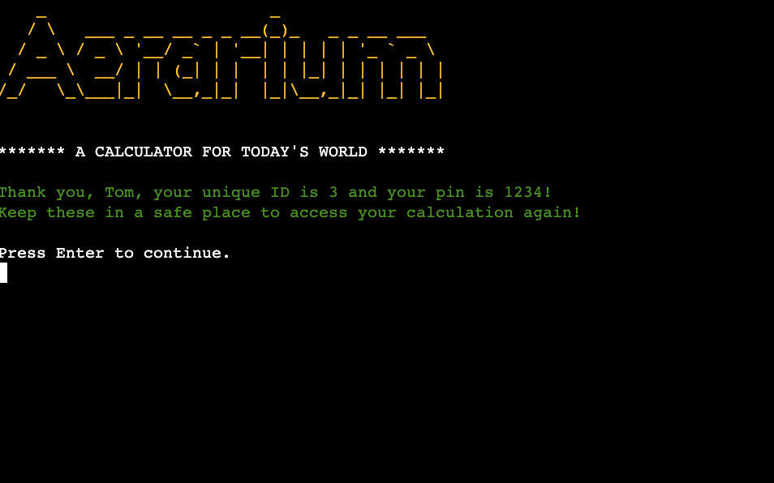

# **Aerarium - A basic Python-based Tax Calculator**
## **Description**
Aerarium is a small program that allows a user to provide a few details relating to their salary and tax status and then calculates and outputs a summary of expected deducations. These are based on accurate Irish 21/22 rates and return values consistent with other such calculators available on the web. 

The program allows a user to save their calculations for retrieval at a later date, using a log-in process. 

The application was named after the term which describes the ancient Roman treasury department, in line with the theme of finances and taxation.

It runs in the terminal window and is deployed to Heroku. 

The live application can be found here: [Aerarium - A basic Python-based Tax Calculator](https://aerarium.herokuapp.com/)

 

 

# **Development**
The terminal-based application was developed using Python as the primary languages and an emphasis was placed on an easy-to-use UX design and best practice.

## **Users and Target Audience**

### **Target Audience**
The target audience comprises of people who wish to assess their own earnings in terms of tax liabilities etc: in this sense, it can be a useful tool in budgeting or to quickly determine to what degree a potential change in salary, e.g. through a promotion, would impact the user's financial bottom line.

### **User Stories**
- A **New User** wants to be able to follow the flow through the program in an enjoyable manner, and obtain the expected information in as few steps as possible. They may wish to save their data to access later. They wish to be able to rely on the calculations in terms of accuracy, and so expect the program be up-to-date.

- An **Existing User** might want to revisit the program and access previously saved data in a straight-forward and intuitive manner. They may return in the following year to see, e.g., if changes to the budget would affect their take-home-pay. As a result, it would be expected that the program is regularly updated and that a message confirming up-to-date status is displayed accordingly. 

- An **Admin User** might want to update the program as new taxation rules emerge: this is easily facilitated through intuitive code-comments and clean overall code.  

## **Features**

### **Logo**
The main program logo is based on ASCII art and was implemented with the help of Pyfiglet.

### **Calculation Functions**
The program ask the user to input their annual salary and tax credits and provides a summary of tax-, PRSI- and USC liabilities based on same. The net wage is returned in annual, monthly and weekly iterations. 

### **Saving and Retrieving Data**
The program gives the user the option to save their calculated values for later access. If the user desires to do so, they are prompted to input a 4-digit number and are issued with a unique id, both of which serve as "log-in" credentials to retrieve the data at a future point. The data is saved to a Google Sheet and is retrieved from same. Rather than presenting retrieved data in a table format, I opted to display same using an f-string narrative. 

### **Google Sheets API**
As mentioned above, data is stored in a Google Sheet for later retrieval by user request: the sheet is accessed by means of Google's API and the gspread library. 

### **Personal Touch**
Great emphasis was placed on user experience, and I felt it was important to provide the user with personalised feedback messages throughout the program's flow: this involved utilising the user's previously inputted name in f-string print reponses and so making the user feel less like they are interacting with a machine.

## **Future Features**

- **Tax Credits and Other Factors** As I specified in the description, the program currently does not take into consideration aspects such as pension deductions or other pre-tax allowances, so this is something that could be added later. Similarly, rather than having the user input their tax-credits, the value could be derived by means of targeted questions, e.g. about marriage status etc.

- **Restarting the Program** I could not find an elegant way of restaring the program to allow for another calculation at this moment in time, and as a result the user will need to reset the program manually if they wish to do so. This is an important feature to be added in the future. 

- **Emailing Data** Another nice feature to implement in future iterations of the program involves prompting the user for an email address and sending the data output to it. 

